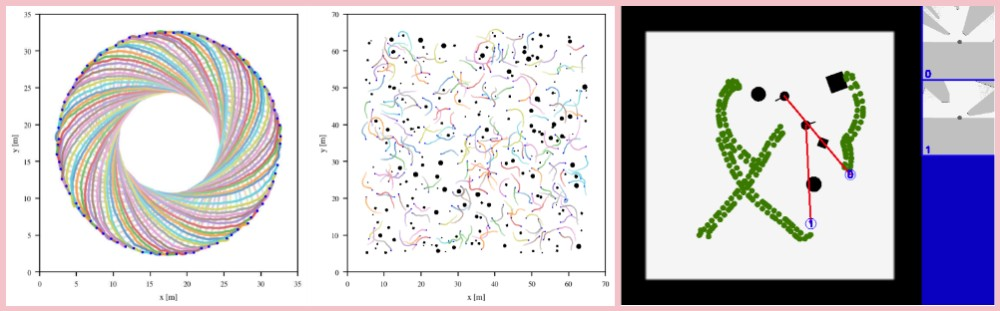

# img_env

A customized grid map-based navigation simulation platform following the Gym API.
- **Very fast**, based on C++, customized for robot navigation
- **Accurate**, not perform physical simulation and time simulation
- **Parallelization**，support multi-scene and multi-robot
- **Pedestrian simulation**，contains pedestrian simulation based on Pedsim and ORCA
- **Gym API**, easy to use in conjunction with other reinforcement learning frameworks
- **Grid_map output**， directly outputs grid_map or raw laser data
- **Parameterized configuration**, easily configure environment information via yaml file, including robot shape and number, pedestrian strategy and number, environmental map and other information
- **Very lightweight**, depends only on OpenCV for visualization


### Quick Start
Recommended system environment: Ubuntu20 + ROS noetic + python3

```
sudo apt-get install libedit-dev

git clone git@github.com:DRL-Navigation/img_env.git

cd img_env
```

#### compile:

```
catkin_make --only-pkg-with-deps img_env
```

#### source
```
echo "source `pwd`/devel/setup.bash" >> ~/.bashrc
```

#### config yaml file
Enter ```envs/cfg``` to configure the yaml to be run. Note, set `env_num` parameter to run nodes simultaneously.

#### generate a launch file


`python create_launch.py test envs/cfg/test.yaml`

the first param is task name, other params is yaml file，if you want to run different yaml files together,

`python create_launch.py test A.yaml B.yaml C.yaml`

the generated file are located at `src/img_env/tmp`

#### start up ROS

open up a new terminal

`roslaunch img_env test.launch`


#### run python

`python env_test.py`


### Explanation

#### State Instance
`envs/state/state.py`
following valuse are all type of numpy, and the first dim means robot_num.
```
    vector_states,  [robot_num, state_dim] vector，state_dim=3 which means the x,y position and yaw to target
    sensor_maps, [robot_num, batch, 48, 48] egocentric sensor map.
    is_collisions, [robot_num] 0 means no collision, 1 means get collision with static obstacles, 2 means get collision with pedestrians, 3 means get collision with other robots.
    is_arrives, [robot_num] 1 means reach the goal while 0 is not.
    lasers, [robot_num, laser_range_total] original laser scan data.
    ped_vector_states, [robot_num, n] n = 1 + vector_info_number * max_ped_number, where 1 means the real ped number
    ped_maps, [robot_num, 3, 48, 48] egocentric 3-channel pedestrians map, which means x，y velocity and position of the nearby pedestrains.
    step_ds, [robot_num] the distance of getting close to the target each step.
    ped_min_dists, [robot_num] the closest distance of nearby pedestrains, used in reward function.
```


#### Wrapper
To modify reward, action space and other operations, please wrapper the package according to the Gym API. 

**!!!** NOTE: 
The order of filling in wrappers in yaml is very important. The first one is enclosure in the innermost layer and executed first, and the last one is enclosured in the outermost layer and executed last. Imagine preorder traversal, postorder traversal of the binary tree.


#### Parameters

All parameters are set in yaml file, they are sent to C++

#### pedestrians model
the 3 regular behaviour of pedestrains:

`pedsim`, `rvo`, `ervo`, thanks to their codes are all opensourced, we converge them and put in `3rd_party`

- `pedsim` is controled by SFM

- `rvo` is controled by orca

- `ervo` denotes the emitional version of rvo

to change pedestrain behaviour, set yaml file `ped_sim:type` with one of [ `pedscene`,`rvoscene`,`ervoscene`] 


### GUI

parameters server

```
# close GUI
rosparam set /image_ped_circle0/show_gui false
# open GUI
rosparam set /image_ped_circle0/show_gui true
# `image_ped_circle0` is the node name, which is configured in the yaml file, `env_name`+env_id
# type `rosnode list` show all nodes
```


please cite：

```
@Article{chen2020distributed,
title = {Distributed Non-Communicating Multi-Robot Collision Avoidance via Map-Based Deep Reinforcement Learning},
author = {Chen, Guangda and Yao, Shunyi and Ma, Jun and Pan, Lifan and Chen, Yu'an and Xu, Pei and Ji, Jianmin and Chen, Xiaoping},
journal = {Sensors},
volume = {20},
number = {17},
pages = {4836},
year = {2020},
publisher = {Multidisciplinary Digital Publishing Institute},
doi = {10.3390/s20174836},
url = {https://www.mdpi.com/1424-8220/20/17/4836}
};
```
```
@inproceedings{yao2021crowd,
  title={Crowd-Aware Robot Navigation for Pedestrians with Multiple Collision Avoidance Strategies via Map-based Deep Reinforcement Learning},
  author={Yao, Shunyi and Chen, Guangda and Qiu, Quecheng and Ma, Jun and Chen, Xiaoping and Ji, Jianmin},
  booktitle={2021 IEEE/RSJ International Conference on Intelligent Robots and Systems (IROS)},
  pages={8144--8150},
  year={2021},
  organization={IEEE}
}
```

